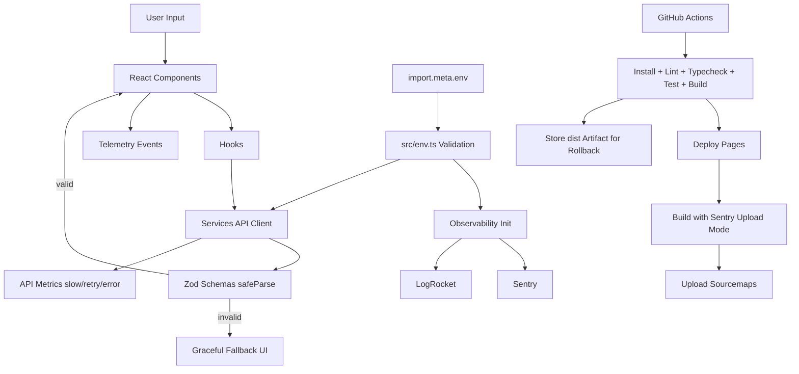

# Draft

Draft is a browser-native publishing app for Markdown/plain-text documents with fixed-page preview and export.

## 2-Minute Onboarding

Prerequisites:
- Node.js 20+
- npm

Run:
```bash
npm install
cp .env.example .env
npm run dev
```

Windows PowerShell equivalent:
```powershell
npm install
Copy-Item .env.example .env
npm run dev
```

## Environment Variables

All runtime/build variables must exist in `.env.example`.

Required keys:
- `VITE_SENTRY_DSN`
- `VITE_SENTRY_ENV`
- `VITE_SENTRY_RELEASE`
- `VITE_LOGROCKET_ID`
- `LOGROCKET_ID`
- `SENTRY_AUTH_TOKEN`
- `SENTRY_ORG`
- `SENTRY_PROJECT`
- `VITE_API_URL`
- `VITE_APP_VERSION`
- `VITE_ENABLE_MSW`
- `VITE_FEATURE_NEW_UI`

Validation:
- Contract check: `npm run check:env` (`scripts/check-env-contract.mjs`)
- Startup validation: `src/env.ts` (Zod parse at boot)

Rule:
- If a key is not in `.env.example`, it does not exist.

## Architecture

Code layout:
- `src/app/components/*`: UI and page/workspace components
- `src/app/lib/*`: export, paging, observability, utility logic
- `src/app/services/*`: API client and resilience behavior
- `src/app/schemas/*`: Zod schemas and types
- `src/app/hooks/*`: data hooks (`components render, hooks fetch, schemas validate`)
- `src/mocks/*`: MSW handlers for failure simulation

Folder architecture schema:
```txt
draft/
├─ .github/workflows/
├─ public/
├─ scripts/
├─ src/
│  ├─ app/
│  │  ├─ components/
│  │  │  └─ ui/
│  │  ├─ hooks/
│  │  ├─ lib/
│  │  ├─ schemas/
│  │  └─ services/
│  ├─ mocks/
│  ├─ styles/
│  ├─ env.ts
│  └─ main.tsx
├─ .env.example
├─ package.json
├─ tsconfig.json
└─ vite.config.ts
```

Schema-first rules:
- Define data shape in Zod before UI integration.
- Validate external payloads with `safeParse`.
- Treat failed validation as unavailable data, not valid state.

## Architecture Diagram



## API Flow and Safety

`fetchValidated` (`src/app/services/api.ts`) includes:
- timeout
- retry limit
- exponential backoff
- in-flight dedupe
- short debounce window
- response cache (TTL)
- schema validation
- API telemetry (`trackApiMetric`)

Rule:
- Frontend must not spam backend.

## Observability and Monitoring

Implemented:
- `ErrorBoundary` + capture pipeline
- Global `window.error` / `unhandledrejection` capture
- Sentry release breadcrumbing
- LogRocket init adapter
- Telemetry helpers: `trackEvent`, `trackPageView`, `trackApiMetric`
- Typed app analytics taxonomy: `src/app/lib/analytics.ts`
- Performance observers:
  - long tasks
  - memory pressure sampling (when available)

Graceful degradation:
- Error fallback UI shows:
  - `Data temporarily unavailable`
  - `Try again later.`

## Golden Rules

- Canonical rule set: [`GOLDEN_RULES.md`](./GOLDEN_RULES.md)
- This file defines release, observability, schema, rollback, and failure-safety non-negotiables.

## Scripts

- `npm run dev` - local dev server
- `npm run build` - production build
- `npm run lint` - TS lint barrier (`tsc --noEmit --pretty false`)
- `npm run typecheck` - strict TS check
- `npm run test` - Vitest
- `npm run test:a11y` - axe accessibility checks (TopBar + Inspector baseline)
- `npm run check:env` - env contract validation
- `npm run check:bundle` - bundle budget gate
- `npm run verify:postdeploy` - static post-deploy verification gate
- `npm run deploy` - manual gh-pages deploy
- `npm run redeploy:release -- <ref>` - trigger rollback workflow via `gh`

## CI/CD

Primary workflow:
- `.github/workflows/deploy-pages.yml`

Pipeline:
1. Install dependencies
2. Validate env contract
3. Lint
4. Typecheck
5. Test
6. Build
7. Bundle budget check
8. Deploy GitHub Pages
9. Upload sourcemaps to Sentry (separate job)
10. Store build artifact for rollback

Release traceability:
- `VITE_SENTRY_RELEASE` is set to Git SHA in CI
- Version/release are exposed in UI

Rollback:
- Workflow: `.github/workflows/rollback-pages.yml`
- Trigger with `release_ref` (tag or commit SHA)

## Deploy Steps

GitHub Pages:
1. Configure repository Pages source to GitHub Actions.
2. Set required secrets in repository settings.
3. Push to `main` (or tag `v*`) to deploy.
4. Run post-deploy verification checklist.

Post-deploy checklist:
- `POST_DEPLOY_VERIFICATION.md`

## Static Hosting and Security

SPA fixes:
- `public/404.html` fallback redirect
- `index.html` route restore script
- `public/_redirects` rewrite support

Security headers/CSP templates:
- CSP in `index.html`
- host-level headers in `public/_headers`

## Security

See `SECURITY.md` for vulnerability reporting.

## License

MIT. See `LICENSE`.
